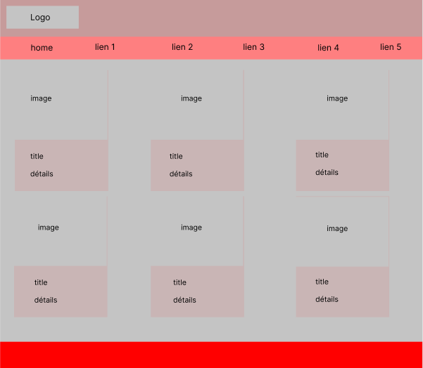

# Recettes de cuisine

Créer une interface qui permet d'afficher les recettes

# Objectifs

- En tant qu'utilisateur je vais pouvoir consulter toutes les recettes disponibles.
- En tant qu'utilisateur je vais pouvoire consulter une recette en détails (étapes de préparation, ingrédients)

# Instructions

- Créer vos composants
- Définir vos props
- Utiliser les données dans le ficher data
- Utiliser le router pour afficher une recette
